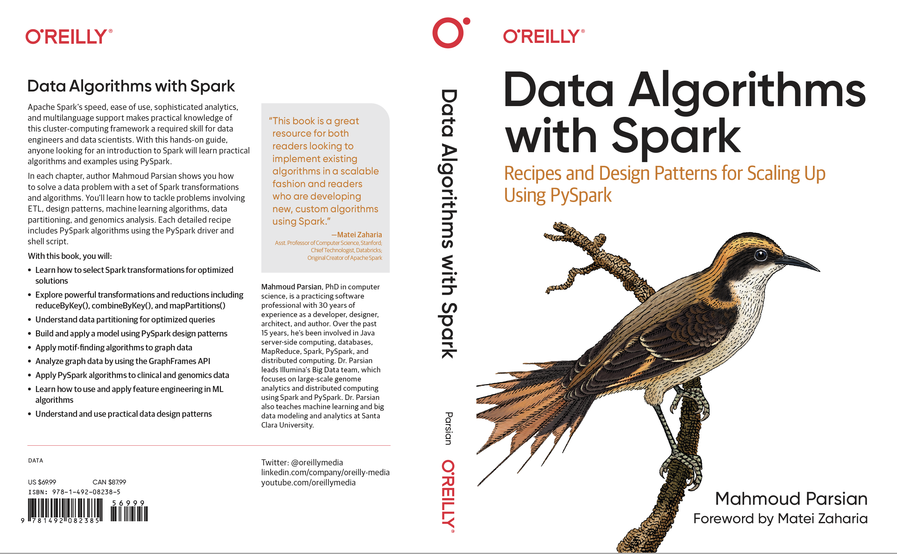
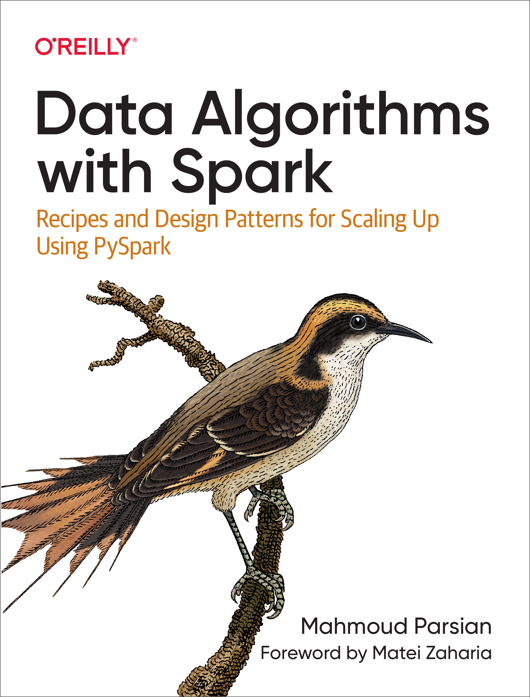
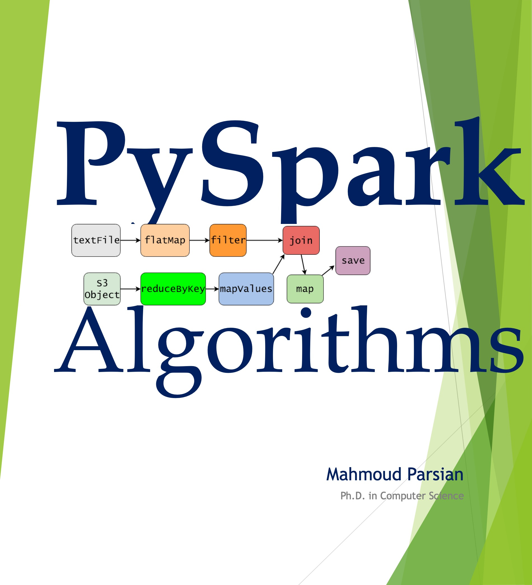
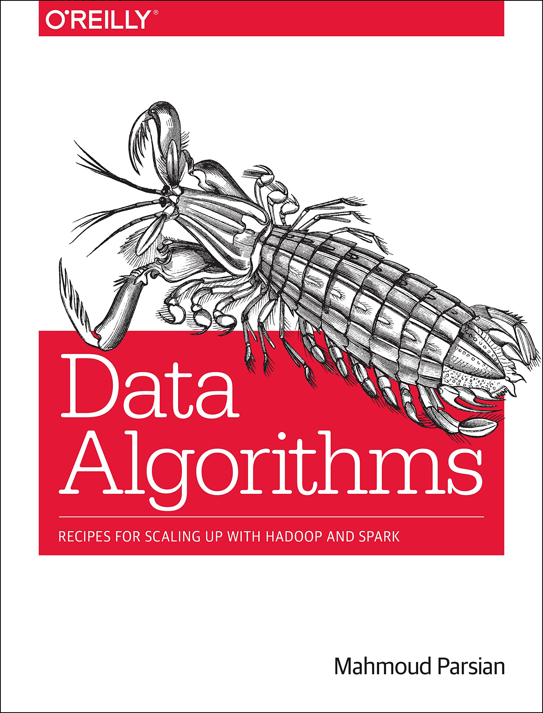

# PySpark Tutorial

* Spark is a multi-language engine for executing data engineering, 
  data science, and machine learning on single-node machines or clusters.

* PySpark is the Python API for Spark.  

# Start PySpark

First make sure that you have started the Spark cluster. 
To start Spark, you execute the following. Note, if you 
are going to run PySpark shell in your laptop/macbook, 
then you do not need to start any clauter -- your 
laptop/macbook as a cluster of a single node:

    export SPARK_HOME=<installed-directory-for-spark>
	cd $SPARK_HOME
	./sbin/start-all.sh


To start PySpark, execute the following:


	cd $SPARK_HOME
	./bin/pyspark


Successful execution will give you the PySpark prompt:


	~  % ./spark-3.3.0/bin/pyspark
	Python 3.10.5 (v3.10.5:f377153967, Jun  6 2022, 12:36:10) [Clang 13.0.0 (clang-1300.0.29.30)] on darwin
	Type "help", "copyright", "credits" or "license" for more information.
	Setting default log level to "WARN".
	To adjust logging level use sc.setLogLevel(newLevel). For SparkR, use setLogLevel(newLevel).
	Welcome to
		  ____              __
		 / __/__  ___ _____/ /__
		_\ \/ _ \/ _ `/ __/  '_/
	   /__ / .__/\_,_/_/ /_/\_\   version 3.3.0
		  /_/

	Using Python version 3.10.5 (v3.10.5:f377153967, Jun  6 2022 12:36:10)
	Spark context Web UI available at http://10.0.0.232:4040
	Spark context available as 'sc' (master = local[*], app id = local-1656268371486).
	SparkSession available as 'spark'.
	>>>


Note that the shell already have created two objects:
* SparkContext (`sc`) object and you may use it to create RDDs.
* SparkSession (`spark`) object and you may use it to create DataFrames.

# Creating RDDs

You may create RDDs by:
* reading textfiles, 
* Python collections and data structures, 
* local file system, 
* S3 and HDFS, 
* and other data sources.


## Create RDD from a Data Structure (or Collection)

* Example-1

		>>> data = [1, 2, 3, 4, 5, 8, 9]
		>>> data
		[1, 2, 3, 4, 5, 8, 9]
		>>> myRDD = sc.parallelize(data)
		>>> myRDD.collect()
		[1, 2, 3, 4, 5, 8, 9]
		>>> myRDD.count()
		7
		>>> 


* Example-2

		>>> kv = [('a',7), ('a', 2), ('b', 2), ('b',4), ('c',1), ('c',2), ('c',3), ('c',4)]
		>>> kv
		[('a', 7), ('a', 2), ('b', 2), ('b', 4), ('c', 1), ('c', 2), ('c', 3), ('c', 4)]
		>>> rdd2 = sc.parallelize(kv)
		>>> rdd2.collect()
		[('a', 7), ('a', 2), ('b', 2), ('b', 4), ('c', 1), ('c', 2), ('c', 3), ('c', 4)]
		>>>
		>>> rdd3 = rdd2.reduceByKey(lambda x, y : x+y)
		>>> rdd3.collect()
		[('a', 9), ('c', 10), ('b', 6)]
		>>> 


* Example-3


		>>> kv = [('a',7), ('a', 2), ('b', 2), ('b',4), ('c',1), ('c',2), ('c',3), ('c',4)]
		>>> kv
		[('a', 7), ('a', 2), ('b', 2), ('b', 4), ('c', 1), ('c', 2), ('c', 3), ('c', 4)]
		>>> rdd2 = sc.parallelize(kv)
		>>> rdd2.collect()
		[('a', 7), ('a', 2), ('b', 2), ('b', 4), ('c', 1), ('c', 2), ('c', 3), ('c', 4)]

		>>> rdd3 = rdd2.groupByKey()
		>>> rdd3.collect()
		[
		 ('a', <pyspark.resultiterable.ResultIterable object at 0x104ec4c50>), 
		 ('c', <pyspark.resultiterable.ResultIterable object at 0x104ec4cd0>), 
		 ('b', <pyspark.resultiterable.ResultIterable object at 0x104ce7290>)
		]

		>>> rdd3.map(lambda x : (x[0], list(x[1]))).collect()
		[
		 ('a', [7, 2]), 
		 ('c', [1, 2, 3, 4]), 
		 ('b', [2, 4])
		]
		>>> 


# Create RDD from a Local File System (Java Example)

	import org.apache.spark.api.java.JavaRDD;
	import org.apache.spark.api.java.JavaSparkContext;
	...
	JavaSparkContext context = new JavaSparkContext();
	...
	final String inputPath ="file:///dir1/dir2/myinputfile.txt";
	JavaRDD<String> rdd = context.textFile(inputPath);
    ...


# Create RDD from HDFS (Java Example)

* Example-1:

		import org.apache.spark.api.java.JavaRDD;
		import org.apache.spark.api.java.JavaSparkContext;
		...
		JavaSparkContext context = new JavaSparkContext();
		...
		final String inputPath ="hdfs://myhadoopserver:9000/dir1/dir2/myinputfile.txt";
		JavaRDD<String> rdd = context.textFile(inputPath);
		...

* Example-2:


		import org.apache.spark.api.java.JavaRDD;
		import org.apache.spark.api.java.JavaSparkContext;
		...
		JavaSparkContext context = new JavaSparkContext();
		...
		final String inputPath ="/dir1/dir2/myinputfile.txt";
		JavaRDD<String> rdd = context.textFile(inputPath);
		...


# Questions/Comments

* [View Mahmoud Parsian's profile on LinkedIn](http://www.linkedin.com/in/mahmoudparsian)
* Please send me an email: mahmoud.parsian@yahoo.com
* [Twitter: @mahmoudparsian](http://twitter.com/mahmoudparsian) 


Thank you!

````
best regards,
Mahmoud Parsian
````

-----


<a href="https://www.oreilly.com/library/view/data-algorithms-with/9781492082378/">
    

<a href="https://www.oreilly.com/library/view/data-algorithms-with/9781492082378/">
    

<a href="https://www.amazon.com/dp/B07X4B2218/ref=sr_1_2">
    

<a href="http://shop.oreilly.com/product/0636920033950.do">
    
